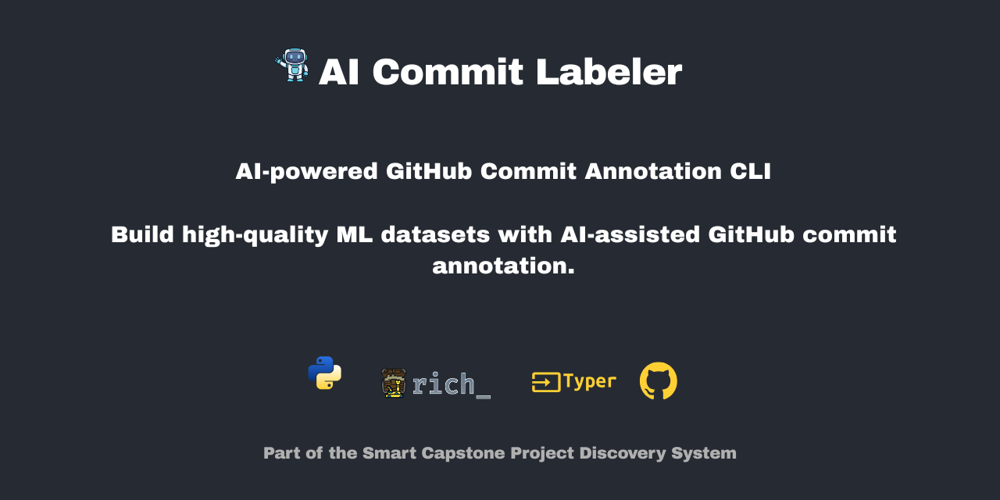

<p align="center">
  
</p>

<h1 align="center">🤖 AI Commit Labeler</h1>

<p align="center">
  AI-powered GitHub commit annotation with human-in-the-loop verification.
</p>

<p align="center">
  
  
  
  
</p>

# 🤖 AI Commit Labeler

> AI-powered CLI tool for GitHub commit annotation with human-in-the-loop verification.

AI Commit Labeler is an open-source Python command-line application that assists developers and researchers in labeling GitHub commits efficiently. It combines AI-generated suggestions with human verification to create high-quality labeled datasets for machine learning.

This project is designed to accelerate the annotation process while maintaining human oversight.

---

## ✨ Features

- AI-assisted commit labeling
- Human-in-the-loop verification
- Beautiful terminal interface using Rich
- Interactive review workflow
- CSV dataset support
- Modular provider architecture
- Mock AI provider for offline development
- Easily extendable to OpenAI, Gemini, Ollama, or other LLMs

---

## 📸 Demo

### Review Screen

> *(Add a screenshot here later)*

```
╭──────────────────────────────╮
│ AI Commit Labeler            │
├──────────────────────────────┤
│ Repository                   │
│ encode/httpx                 │
│                              │
│ Commit                       │
│ Fix authentication middleware│
│                              │
│ AI Suggestion                │
│ LOW_VALUE                    │
│ Confidence: 95%              │
╰──────────────────────────────╯
```

---

## 🚀 Installation

Clone the repository.

```bash
git clone https://github.com/YOUR_USERNAME/ai-commit-labeler.git

cd ai-commit-labeler
```

Create a virtual environment.

```bash
python -m venv .venv
```

Activate it.

### macOS / Linux

```bash
source .venv/bin/activate
```

### Windows

```bash
.venv\Scripts\activate
```

Install dependencies.

```bash
pip install -r requirements.txt
```

---

## 📂 Project Structure

```
ai-commit-labeler/

├── docs/
├── examples/
│   └── sample_commits.csv
│
├── src/
│   └── ai_commit_labeler/
│       ├── cli.py
│       ├── loaders/
│       ├── models/
│       ├── providers/
│       ├── services/
│       ├── storage/
│       ├── ui/
│       └── version.py
│
├── pyproject.toml
├── README.md
└── LICENSE
```

---

## 💻 Usage

Show application version.

```bash
PYTHONPATH=src python -m ai_commit_labeler version
```

Review commits.

```bash
PYTHONPATH=src python -m ai_commit_labeler review examples/sample_commits.csv
```

Example output:

```
Repository:
encode/httpx

Commit:
Update README

AI Suggestion

LOW_VALUE

Confidence: 95%

[A] Accept
[O] Override
[S] Skip
[Q] Quit
```

---

## 🏗 Architecture

```
                 CLI
                  │
                  ▼
          Review Service
          ├─────────────┐
          ▼             ▼
    CSV Loader     AI Provider
          │             │
          ▼             ▼
     Commit Model  Prediction Model
                  │
                  ▼
             Review Screen
                  │
                  ▼
             CSV Writer
```

---

## 🔄 Workflow

```
CSV Dataset

      │

      ▼

Load Commits

      │

      ▼

Display Commit

      │

      ▼

AI Suggestion

      │

      ▼

Human Review

      │

      ▼

Save Label

      │

      ▼

Training Dataset
```

---

## 🛠 Technologies Used

- Python 3.12+
- Typer
- Rich
- Pandas
- Dataclasses
- ABC (Abstract Base Classes)

---

## 📋 Roadmap

### ✅ Version 0.1

- Project structure
- CLI
- CSV Loader
- Review Service
- Rich UI
- Mock AI Provider
- Interactive Review
- CSV Export

---

### 🚧 Version 0.2

- Override labels
- Progress indicator
- Resume review sessions
- Better terminal UI
- Smarter rule-based AI

---

### 🚧 Version 0.3

- OpenAI integration
- Gemini integration
- Ollama integration
- Confidence explanation
- Batch review

---

### 🚀 Version 1.0

- Plugin architecture
- PyPI package
- Unit tests
- GitHub Actions CI/CD
- Documentation website

---

## 🎯 Motivation

Creating high-quality labeled datasets for GitHub commit classification is a time-consuming manual process.

AI Commit Labeler reduces annotation time by combining AI-generated suggestions with human verification, enabling researchers to build reliable datasets more efficiently.

---

## 🔗 Related Projects

### GitHub Commit Quality ML

Machine learning pipeline that trains commit quality prediction models using datasets created with AI Commit Labeler.

↓

### Smart Capstone Project Discovery System

The final capstone project that integrates the GitHub Commit Quality ML model to evaluate GitHub repositories and assist students and faculty in discovering and assessing capstone projects.

```
AI Commit Labeler
        │
        ▼
GitHub Commit Quality ML
        │
        ▼
Smart Capstone Project Discovery System
```

---

## 🤝 Contributing

Contributions are welcome.

Feel free to open issues, submit pull requests, or suggest improvements.

---

## 📄 License

This project is licensed under the MIT License.

---

## 👨‍💻 Author

**Akshar Vaghasiya**

B.Tech Computer Science & Engineering

PES University

GitHub: https://github.com/AKSHARVAGHASIYA